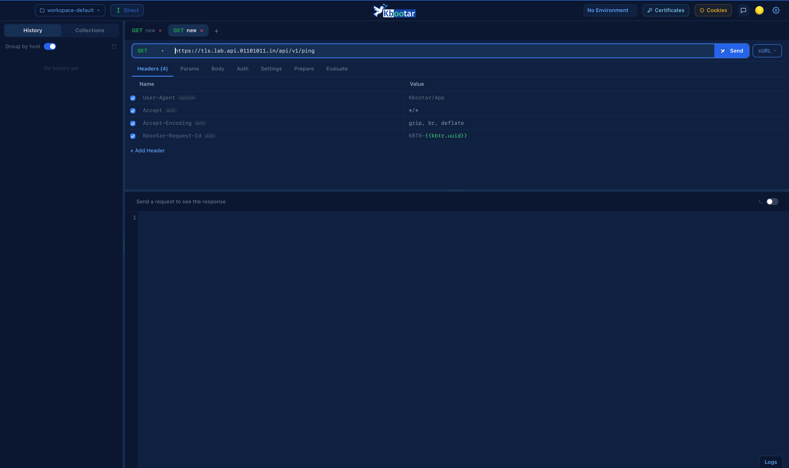
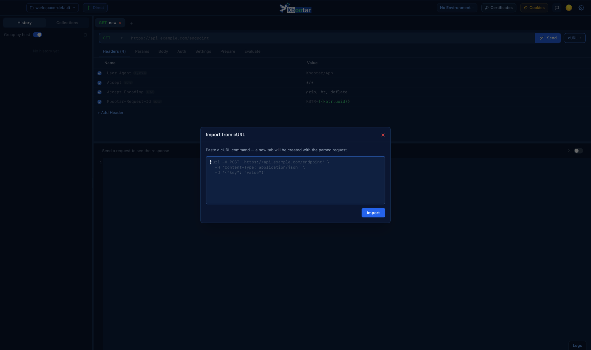
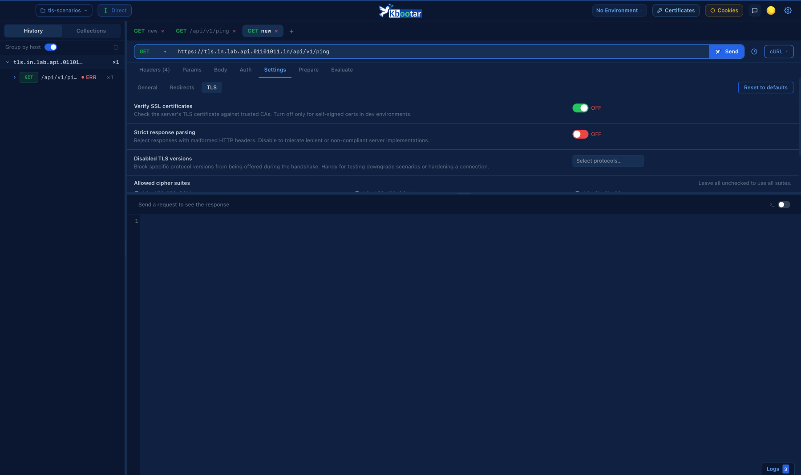
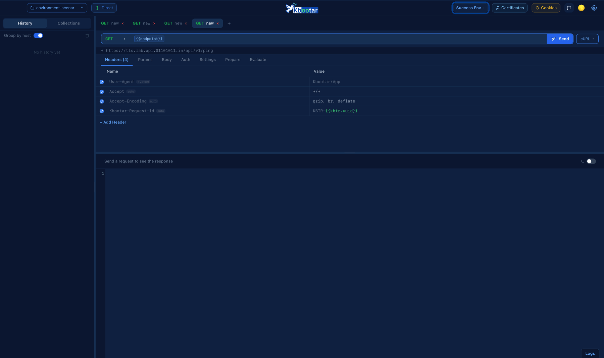
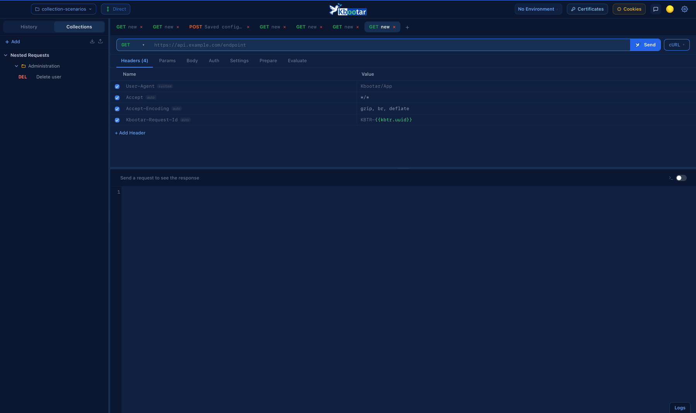
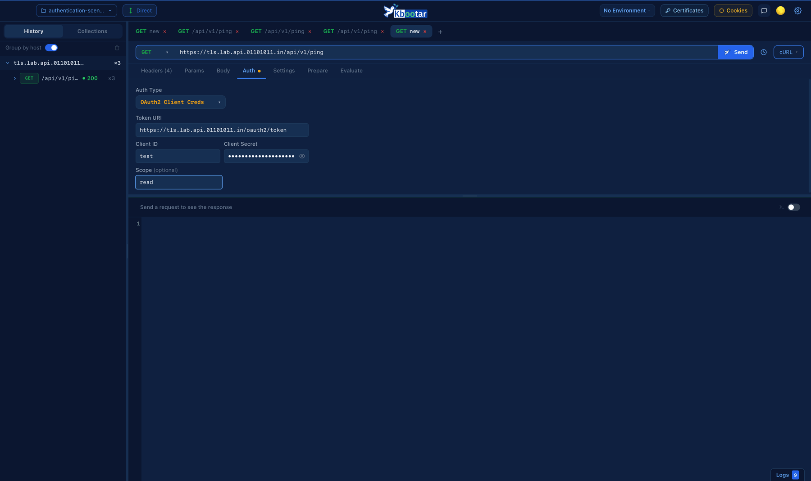
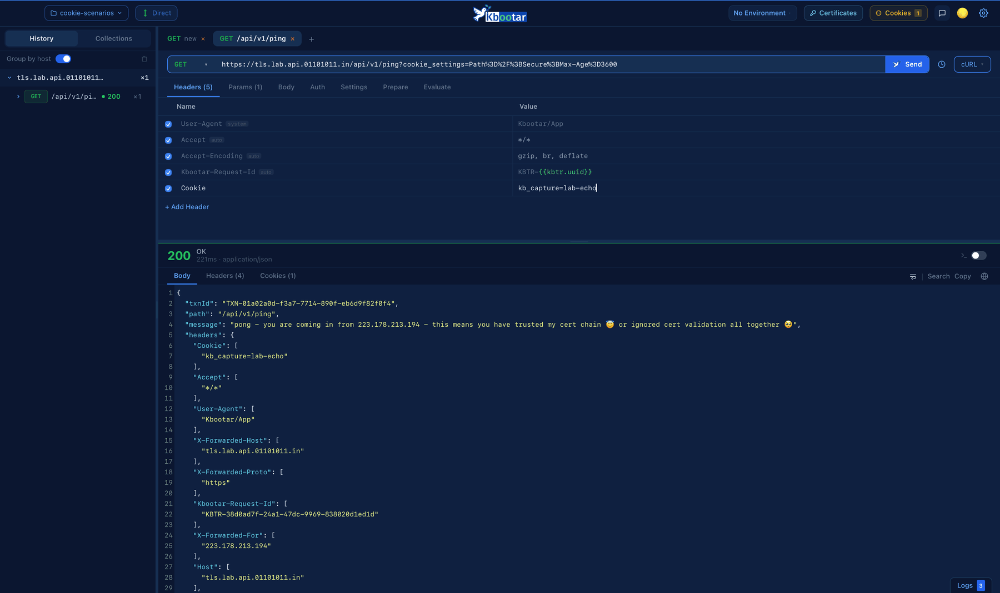

# Kbootar

Kbootar — messenger for your APIs.

This repo holds releases only — no source code lives here.

## Features

- Request builder — method, URL, headers, params, body (raw, form-data, urlencoded, binary)
- Auth — Basic, Bearer, API key, OAuth2 (client credentials), JWT
- Collections with folders; import from Postman, Insomnia, cURL, HAR; export/import as `.kbtr`
- Environments with variable substitution; multiple workspaces
- Response viewer — status, timing, headers, cookies
- TLS inspection — certificate chain, trust status, self-signed detection; mutual TLS (client certificates)
- Cookie jar; HTTP/HTTPS proxy support
- Pre-request and test scripts
- History, grouped by host
- Auto-updates

## See it in action

**Send a request**

**Import a cURL command**

**TLS certificate inspection**

**Switch environments**

**Organize requests into collections**

**OAuth2 client credentials — fetched once, cached after**

**Cookie jar — captured automatically, reused automatically**

## Download

**macOS** — [Download the latest release](https://github.com/kbootar/app/releases/latest)

Universal binary (Apple Silicon + Intel), signed and notarized by Apple — no security warnings on first open.

Each release includes two files:
- `kbootar[-beta]_<version>_universal.dmg` — the installer. Download this one.
- `kbootar[-beta]_<version>_universal.app.tar.gz` — used only by the app's own auto-updater. Not for manual installs.

**Windows** — planned, not yet available.

## Channels

- **Stable** (`kbootar.app`) — general use.
- **Beta** (`kbootar Beta.app`) — installs side by side with stable, gets new features first, may be less polished. Marked "Pre-release" on the [releases page](https://github.com/kbootar/app/releases).

Both channels update automatically once installed — checked every 2 hours, whenever the app regains focus, or on demand from the app's "Check for Updates…" menu item.

## Feedback & issues

- In-app: the feedback button in the header
- Here: [open an issue](https://github.com/kbootar/app/issues)
